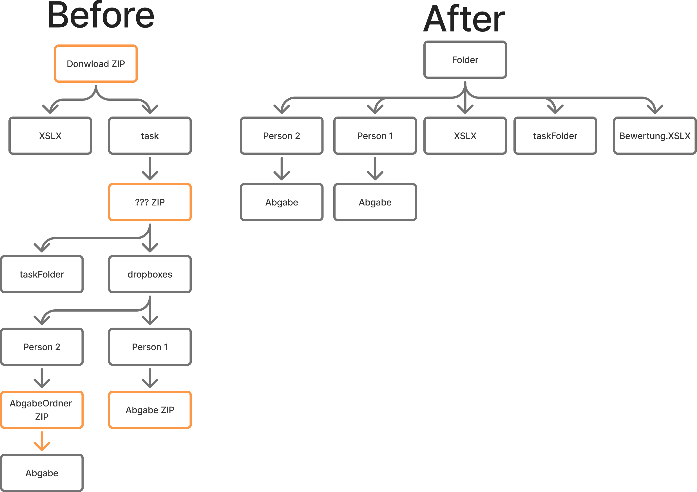
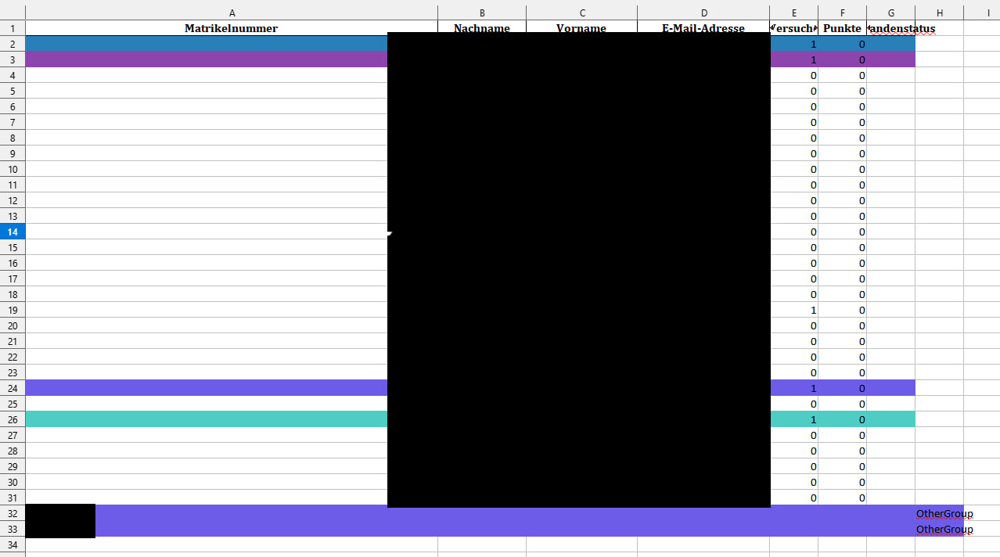

# OPAL ZIP Extractor



## Run

```bash
python3 main.py <path_to_zip> <group_nr>
```

### Install dependencies

```bash
uv pip install -r requirements.txt
```

### General UV stuff

#### Create new UV

```bash
uv venv .venv
```

#### Activate UV

##### Linux/Mac

```bash
source .venv/bin/activate
```

##### windows

```bash
.venv\Scripts\activate
```

## Example Output Table


